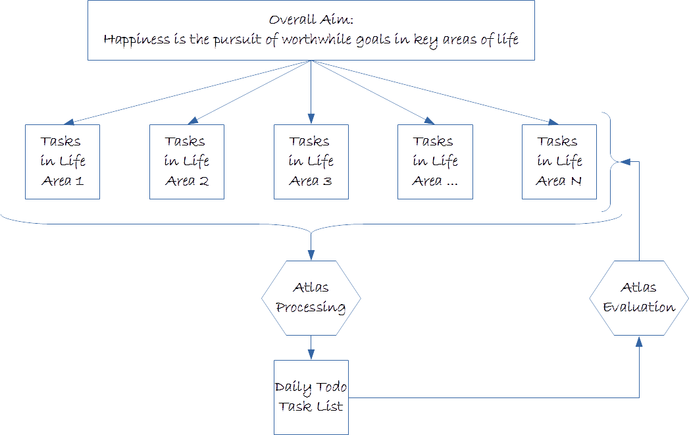

# What is _Atlas_?

> Happiness is the pursuit of worthwhile goals in key areas of life.
> This pursuit is done by continuously completing smaller and prioritized tasks.

_Atlas_ (Automatic Task List Administration System) is a personal task management tool. It automatically compiles a daily todo task list based on task definitions in all relevant areas of life, and personal preferences.

# What can _Atlas_ do for you?

_Atlas_ helps you to:

* Break up goals into tasks
* Prioritize and sequence tasks
* Focus on what needs to be done _right now_
* Store new tasks and ideas for processing later on.

 
# How does it work?

_Atlas_ workflow consists of the following steps:

1. Define all tasks that need to be done in each area of life
2. Select tasks with highest priority (top tasks) 
3. Specify personal schedulling preferences
4. Run _Atlas_ to produce a daily todo task list.

As tasks are done during the day, they can be marked as done, or for further reschedulling. This information can be used for evaluating one's performance by _Atlas_.

# _Atlas_ workflow

# Who is it intended for?

_Atlas_ is best suited for one's own personal use, rather than for large and complex projects.

# Development status

_Atlas_ is in very early stages of development, and a lot of new features are in the works.

# Copyright and License

Copyright © 2019 Novak Petrovic

_Atlas_ is free (as in freedom!) and open source software released under the [GNU General Public License Version 3](LICENSE.md).

# Further reading

If you like what you have read so far, here are some more detailed articles that explain Atlas in more detail:

* [_Atlas_ rationale](docs/atlas-rationale.md)
* [_Atlas_ syntax and structure](docs/atlas-syntax-and-structure.md)
* [Installing _Atlas_ on Windows](docs/installing-atlas-on-windows.md)

